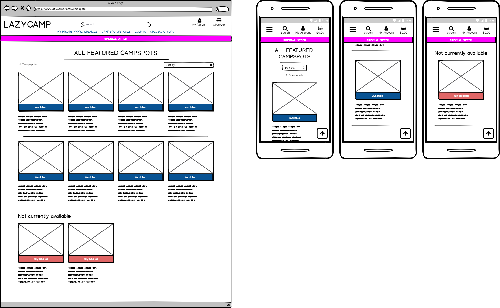
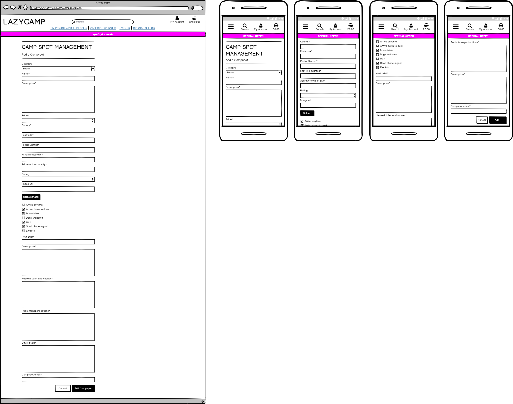
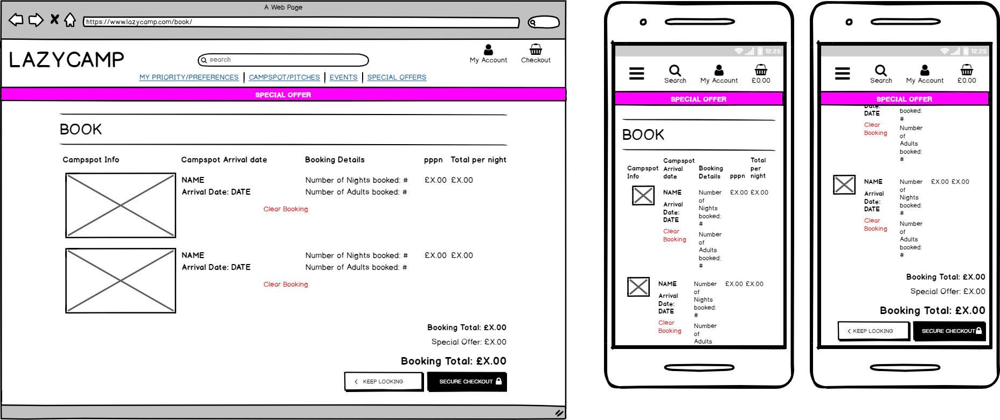
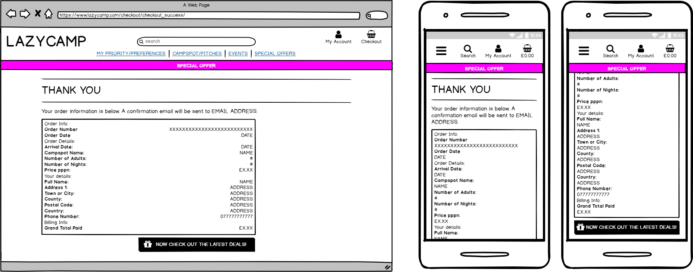

Balsamiq 

# LaZy Camp

The spontaneous campspot booking app.
https://new-lazycamp.herokuapp.com/ - automatic!
[Milestone Project4 - Lazycamp](https://new-lazycamp.herokuapp.com/)

## Project purpose

Camping spontaneously on the spur of the moment is currently very difficult unless you are a seasoned camper or very familiar with the area you want to visit.
Existing options discourage last minute bookings by making it difficult, often blocking out the current and next date as booking options, or insist on early arrival times which prohibit last minute decisions for a night away. 

Lazycamp will instantly list available sites on the day, in the county or postal district you search for,  without having to search each individual site details only to find at the end your choice is unavailable. 

The freedom of the open road can be exhilerating. This is currently easy if you use the major hotel booking sites but if you want to camp along the way it is  tricky.

Currently 12% of campers do not book ahead, blaming the weather. Checking rain and sunshine is an important consideration for many tent lovers. Again this is discouraged by the camping and caravanning industry in the UK because allowing users to wait and check the weather makes many business users feel vulnerable. When asked users will always say they would camp more if you could book without the need for so much planning. Lazycamp aims to give the evidence to business users that if they are willing to take late bookings they will fill all their empty spots and generate more income. 

This concept has proved itself in all other areas of accommodation booking. Making it easier for users to book when they want is going to benefit users immediately and business users ultimately. 

Lazycamp will also open up the opportunity for microcampsites to spring up near to airports, festivals and seasonal attractions that may not be profitable to run all year round , for example, in Scotland, the number of tourists each summer excedes the number of overnight accommodation. A farm which may have a beautiful view of a lavender field or autumn forest may want to just run for a month. Lazycamp is a next generation, user led,fast campspot booking system, which will promote these microcampsites that would be very difficult to find otherwise.

Lazycamp creates flexibility that does not exist currently and limits the amount of research necessary to find what you a user wants.

In addition to overnight camping and caravanning, Lazycamp will promote camping events for between 30-300 people. The theme of the events will vary from tech, food or alcohol detox to campfire music, outdoor cooking and holistic fresh air therapies. 
With  crowded indoor gatherings still being actively discouraged this is the perfect time for people to explore wild camping, microcampsites or established campsites for a short break or holiday.

Lazy camp is all about making it easy and attractive for users who do not enjoy extensive research and preplanning. 

This project will roll out in Wales and Scotland first. The focus being in a smaller area will hopefully attract more hosts and users as searches will generate more options. 

Because the camping season in the UK is so short campsites need to fill their sites to be viable. Lazycamp will fill last minute spots and cancellations. 

UX

Use this section to provide insight into your UX process, focusing on who this website is for, what it is that they want to achieve and 
how your project is the best way to help them achieve these things.

In particular, as part of this section we recommend that you provide a list of User Stories, with the following general structure:

earn by diecting calls and emial enquiries then bookings 

compare to booking.com lastminute.com aribnb couch surfing 

## Ux

### Goals

#### Visitor Goals

The target audience for Lazycamp are:

* Experienced campers who get the urge to book last minute because of good weather.
* Experienced campers who want to try a new area for a short stay.
* Experienced campers who want to change sites rather than stay in one place. Maybe to follow good weather or explore a region of the country they do not know. 
* People who enjoy road trips.
* People who have never tried camping before because of the research and planning needed.
* Spontaneous and adventurous people.
 
User goals are:

* Find a camping spot for the night last minute in the area they would like to stay.
* Find an event for a weekend or week.  
* Either to find a campspot quickly or browse for inspiration.
* To be able to book campspots ahead of time quickly without having to search individual sites for availablity. 
* Be able to navigate the site easily, find what I need and make a safe and secure purchase.
* Book from a fast, reliable and trustworthy online system.
* Have the option to phone/email or chat if I have questions.
* To be able to book from my mobile phone then have all the details sent to my mobile phone in an email with simple process then only having to give my name and email address on arrival.
* Not needing to check in during office hours because all access details and pitching information will automatically come to my phone at the time of booking in a precitable format including detailed directions from nearest landmark. 

Lazycamp meets all these needs because:

* Unavailable campsites are listed beneath all available sites for instant information on whether or not a site can be booked. 
* The focus of the site design has been instant view of what the user wants in the right location.
* The booking process is fast.
* An email is sent to the user and the business user with all the details needed. 

#### Business Goals

* Fill all my camping spots and maximise revenue.
* Attract new customers.
* Provide all the customers information they need online so that they do need to call and email.
* Manage customer expectations online so I always have happy customers who are right for what I have on offer so minimising the risk of complaints, bad reviews and refunds.
* Have a booking system which I do not have to manage.
* Have an online payment system I do not to manage and keep secure.

#### Lazycamp meets all these needs because:

* I can add and amend my data easily.
* Booking and payments will be taken then forwarded to me.
Lazycamp meets all these needs because:
* Most queries will be answered online.
Lazycamp meets all these needs because:
* If customers do want to contact us, general questions will be answered for us by the Lazycamp team. 
* Customer expectations will be managed by the lazycamp team and queries can be answered outside hours.   

## User stories

As a user type, I want to perform an action, so that I can achieve a goal.
As a user I expect to be able to quickly find the nearest pitch/ site or spot where I can safely camp for the night.

As user I want to cleary see which campspots are available and not be wasting time being presented with fully booked campspots. 
I do not want to waste my time, be frustrated or disappointed.

As a user, if I have viewed a campsite and it is sold out, I want to see it still featured but now fully booked. This will stop me being confused if the spot has disappeared from all views and I may wonder if I saw it on a different site. 

As a user I may have needs or preferences that I want to be able to prioritise in a search for example, pets, car space, public transport, shower, electricity, local amenities.

As I user I want to know if the site is quiet, lively, family oriented, waterside, farm, wood, mountain etc.

As I user I want to know the price I will need to pay and a big advantage will be to prepay so that I can arrive when I want and know my place is secured.

As a user I want to be able to access the pitch normal hours and spontaneously.

As I user I want to ensure that the site participation is current and that I will have access and knowledge of where to go exactly.

I do not want to be given outdated event or pitch information. 

I want to know a fixed basic price and what will cost me extra. Do I need £1 coins for on site facilities e.g showers, lockers or gaming. 

As I user I may want to try camping for the first time with tips and ideas and to make my experience as comfortable as possible using know how from seasoned and well travelled campers

As a user I may need local information e.g. scottish midges, noisy frogs, local early cockerel or noisy dawn chorus, farm animal smells etc. I want to know the bad points as well as the good so I know what to expect, have the option to prepare so that I can relax and enjoy myself.

As a user I would like a profile of previous bookings and to find them easily. 

I would like to a very simple login process. I would like password reset. 
Possibly I would like to login through social media. 

As a user  enjoy a blog or chatroom to help get ideas or make plans? 

I want my payment to be made easily and securely. I want email Acknowledgements

I would like messages appear when I submit, enquire or book that tewll me I have been successful. 

As  a user I would like email confirmation with all the information I will need to find and access the camp spot.. 

If I am camping my phone may not be charged and I am unlikely to have been able to print my booking so I would like my email address and name to be evidence enough to the business user .

I want flexibility and maybe a credit offer if I can not make my booking. 

As a user I would like to read how other users got there and found it. How they slept is important. Did they feel secure?. 

As a user I would like to know what is closest to my ideal spot if there are no ideal spots. for example i have 2 children and a dog so it must be a child and pet friendly site but I may be willing to park a distance away from the pitch or do without electric if needed. 

As a user I would like spinners to show that my payment is being processed.

As a user I would appreciate tooltips to ensure I do not make mistakes when I make my booking.

As a user I would like to make final checks to my booking before payment is made. 

As a user I want to be able to use familiar chat messaging e.g. Facebook messaging. I can then check when the recipient last checked the messages and know when my message has been seen. I would prefer this to an unfamiliar chatbox not knowing if I am being responded to by a bot or a real person. 

## Professionals/Business Users

As a business user I want to promote my campspot and fill it up to the last minute to maximise bookings during the short camping season. 

As a business user I want to easily add and update campspot details.

As a business user I want to quickly notify customers that the spot is fully booked and now unavailable tp prevent over booking.

As a business user I want email notification of each booking with contact details of the customer.

As a business user organiser I want flexibilty to be able to promote a camping event or fill pop up spots near a yearly festival or sporting event. 

As a business user I will want to to be able to delete my campspot easily if last minute bookings are creating problems.

As a business user i would like to be able to promote my last spots until the last minute.

I will want to easily turn the availability on and off with immediate effect. 

I want to be able to set a limit of pitches and once exceded no more be accepted. 

I will want to add then amend possibly delete my pitches to manage customer expectations and minimse the effort of having people arrive late.

I want to be able to get an email each time I have a booking or log on to my profile to see who and when users will be arriving each day. 

I want to be able to offer extras that can be paid for locally or on the site. 

As a user I want to know how much I am owed from my profile.

AS a user I do not want to contacted outside hours and so customers can autofind info on the site for late arrival policy etc. or I want to charge extra for late arrivals. 

As a business user I may offer a seperate late arrival area or a late arrival area as a trial only 

Lazy camp is for the spontaneous. Last minute plans to fit the weather or the call of the wild.

Coming out of the covid pandemic travellers may not wish to book abroad and may be keen to get away for a few days. If i can be ready for the end of lockdown the site may get a lot of interest. 

The scottish 500 is an aspirational road trip with world class sunsets, wild beaches, cliffs, accessible islands with turquoise seas, mountains, culture, heritage, castles and legend. 
To prebook this is tricky and limits the enjoyment of the trip.
A last minute decision to divert or stay an extra night is bliss. lazy camp allows for this.

Many people do not know how to prepare for a camping trip and so never experience the freedom it offers. Lazy camp will offer a set up ready to arrive with no kit and leave with your back back.

Late arrival is currently difficult. This will be one of the features on offer. 24/7 pitches will be available

As a business user I do not want to lose enquiries if the chat is not answered quickly enough, using messenger means all chat enquiries are stored so can be reignited while customer expectations of FB messenger will give more time to answer. 

As a business user As a user org I may want to offer a limited number of places and show count down.

I want my event to be evident closer to the time and be removed when the times has past.

## All visitors to the site will expect/want/need:

Good navigation.

Fast pinpointing what I want.

Fast booking.

Be sold what I want and need not what the business wants to to buy.

## Development planes to achieve objectives.

### The strategy plane

Use agile design to lay out the foundations of booking system which is more attractive to users but satisfies the requirements of business users
The strategy is to enable users to quickly find available camp spots that are free for the date they require
within a searched for postal district or county.

Offer over night stays on camping sites, spots, independent small pitching places, farms, fields, land, gardens, driveways so take the uncertainlty out of raod trips

Once the spots have been found in a given area that are available, the user can sort in to what is more important to them e.g price, category, 

The strategy is to fill up spots for the spot owners seamlessly and effortlessly. 
Most current system necessatate ringing round various sites and paying over the phone with a credit card. 
This is unreliable and unsecured. 

As the database fills with more campspots we will be able to offer extra filters

We strategised to simplify the bookings, simplify  payment process, promote smaller independent sites and 
fill empty spaces on established sites.
Strategy aim would immediately attract the 12 % of users who do not book ahead and wait to judge the weather 
offer convenience and speed to the 88% of campers who want to book ahead. 

Still offer traditional phone and email booking so be useful and attractive by convention.

### The scope plane
The scope will be to 
attract users by offering simplicity and fast locating which sites are available with fast reliable payment.

The business user will be able to add their sites quickly and simply then turn the featuring on the site on and off with simple boolean checkbox.

### Structure
The site is structured to guide the user to book online which will be the preferred option for users and business users once they manage to adopt the process.
In the interim the structure does offer a less obvious traditional booking system by phone or email but the added option of FB messaging. 
Lazycamp considered that a chatbox but user feedback favoured the familiarity of social media as a mechanism for direct contact with the benefits of users knowing when the messages were last checked and managing expectations of when their queries will be answered also knowing who they are speaking to.
Chatboxes are a little impersonal and faceless for the travel industry which expects a more personal persuasive, friendlier touch.

### Skeleton
The home page uses design to direct the user to the online and payment booking system

### Surface plane
Appearance, images, colour choices and fonts.

Extensive colour work has been tested during development. 
Women choose where to stay and eat so pink was favoured.

The bootstrap button and text colours which signify success, alert, warning, info and primary versus secondary actions/notification was adhered to. 
The colours were softened for the holiday rather than corporate feel. 

Modern design conventions were followed. 

The forms to complete were kept very simple. 
Focus to be kept on the information. 

The font chosen to be modern and easy to read. The logo uses a bespoke font with character, however, because the 'A' symbolised by a tent needs some interpretation the clarify of all the other letters was priority. 

#### Wireframes

<!-- 

 -->

## Quick guide / Features

1. Home app
 * index.hml loading page
 *
 *
2. Campspots app
 * campspots.html renders all spots featured, separating available and non available spots. There are also coming soon spots featured which have been added by the business user but  not yet authorised for inclusion on the site. They are situated with the unavailable fully booked sites at the bottom. 
 * campspot_detail.html individual campspot details with the option to book or return to campspot.html page to keep looking. 
 * users with an authorised profile can edit (edit_campspot) and delete campspots from this page.
 * add_campspot page allows authorised users to add campspot listings.
3. Book app
 * after selecting number of nights, a booking date and number of adults in campspot_detail.html
 * book.html displays the booking for users to double check before payment. 
 * The booking can be deleted on the book.html page
 * The booking can be amended by deleting the old booking and returning the user to original campspot_details chosen at the same time. 
 * Can procede to either checkout.html or return to campspot.html to keep looking 

4. Checkout app
 * checkout.html features a form and stripe payment details to make a booking.
 * checkout_success.html renders once booking has been made successfully.
 * a confirmation email is sent to the user and all the relevant business users so that details can be checked instantly without dependency on admin

5. Media
 
 * media files are stored in the project
 * media files are stored in AWS bucket which links to heroku directly.

6. Products app- so named for agile design because this will also have new revenue and sales ideas added e.g. if demand for camping kit is there we will sell the ship to the site to be ready for use. 
 * products.html renders all events featured. 
 * product_detail.html individual event details.
 * users with an authorised profile can edit (edit_campspot) and delete products from this page.
 * add_product page allows authorised users to add product listings.

 * Products app also contains contact information as this will be the section for products (events/kit or to spots which only accept payments directly). contact.html has contact form and telephone number.

 * messenging.html allows FB chat.

* Direct telephone call link
* fast email enquiry by passing need for form. 

7.   Profile app 
*  profile.html form completion allows users to register and add profile
*  Item 2a -- user dashboard 
*  Item 2b
*  Lists user orders in profile option
*  Campspot Management allows edit and deleting. For example, simple checkbox to signify availability. 

Static folder
Templates folder
Register Page
Login Page

### Features Left to Implement
Possibly social media login. 

All legals, refund policy, cookie policy.

Customer rating API.

Availabilty calculations and auto countdown for ticket sales and number of spots. 

Image kit works perfectly locally but once deployed is not compatible with S3

Technologies Used
In this section, you should mention all of the languages, frameworks, libraries, and any other tools that you have used to construct this project. For each, provide its name, a link to its official site and a short sentence of why it was used.

## Testing

Testing information can be found in separate  file

## Deployment

To deploy Lazycamp booking site to heroku, the following steps should be taken:

1. Create a requirements.txt file using the terminal command pip freeze > requirements.txt.

2. Create a Procfile with the terminal command echo web: python app.py > Procfile.

3. git add and git commit the new requirements and Procfile and then git push the project to GitHub.

4. Create a new app on the Heroku website by clicking the "New" button in your dashboard. Give it a name and set the region to whichever is applicable for your location.

5. From the heroku dashboard of your newly created application, click on "Deploy" > "Deployment method" and select GitHub.

6. Confirm the linking of the heroku app to the correct GitHub repository.

7. In the heroku dashboard for the application, click on "Settings" > "Reveal Config Vars".

Set the following config vars:

Key	Value
AWS_ACCESS_KEY_ID	<your secret key>
AWS_SECRET_ACCESS_KEY	<your secret key>
AWS_STORAGE_BUCKET_NAME	<your AWS S3 bucket name>
DATABASE_URL	<your postgres database url>
HOSTNAME	<your heroku app hostname>
SECRET_KEY	<your secret key>
STRIPE_CANCEL_URL	<link to all-products page in your app>
STRIPE_PUBLISHABLE	<your secret key>
STRIPE_SECRET	<your secret key>
STRIPE_SUCCESS_URL	<link to checkout/confirm page in your app>

From the command line of your local IDE:

Enter the heroku postres shell
Migrate the database models
Create your superuser account in your new database
Instructions on how to do these steps can be found in the heroku devcenter documentation.

In your heroku dashboard, click "Deploy". Scroll down to "Manual Deploy", select the master branch then click "Deploy Branch".

Once the build is complete, click the "View app" button provided.

From the link provided add /admin to the end of the url, log in with your superuser account 

and create instances of ShippingDestination and Product within the new database.

Once instances of these items exist in your database your heroku site will run as expected.

In particular, you should provide all details of the differences between the deployed version and the development version, if any, including:

Different values for environment variables (Heroku Config Vars)?
Different configuration files?
Separate git branch?
In addition, if it is not obvious, you should also describe how to run your code locally.

Credits
Content
The text for section Y was copied from the Wikipedia article Z
Media
The photos used in this site were obtained from ...
Acknowledgements
I received inspiration for this project from X
In summer 2019, I drove to from Manchester in the UK to Mainland Greece then on to the Greek Islands. Booking camspites along the way was too difficult.
 One night my son and I were scaling a fence with our tents and sleeping bags.
Another night I accidently camped on a communal residential lawn which has once been a campsite but was then private property. I was woke up by an 
angry chalet owner insisting I was trespassing. +

Defensive design planning

JQUERY -This added functionality to the site e.g. navigation toggle.
JINJA - to simplify displaying data from the backend of this project smoothly and effectively in html.
BEAUTIFIER - to check code and improve code readability.

## Technologies Used

### Tools

* [Gitpod](https://www.gitpod.io/) is the IDE used for developing this project.
* [Visual Studio Code](https://code.visualstudio.com/) is the IDE used for developing this project locally when no internet was available. Also for using extensions which proved to be more reliable in VSC than in the more rececently established gitpod e.g. beautifying the code
* [Django](https://www.djangoproject.com/) as python web framework for rapid development and clean design.
* [Stripe](https://stripe.com/gb) as payment platform to validate and accept credit card payments securely.
* [AWS S3 Bucket](https://aws.amazon.com/)  to store static files and images entered into the database.
* [Boto3](https://boto3.amazonaws.com/v1/documentation/api/latest/index.html) to enable creation, configuration and management of AWS S3
* [Django Crispy Forms](https://django-crispy-forms.readthedocs.io/en/latest/) to style django forms.
* [Heroku](https://www.gitpod.io/) Heroku for deployment
* [Django Storages](https://django-storages.readthedocs.io/en/latest/) a collection of custom storage backends with django to work with boto3 and AWS S3.
* [Gunicorn](https://pypi.org/project/gunicorn/)WSGI HTTP Server for UNIX to aid in deployment of the Django project to heroku.
* [Pillow](https://pillow.readthedocs.io/en/stable/)as python imaging library to aid in processing image files to store in database.
* [Psycopg2](https://pypi.org/project/psycopg2/) as PostgreSQL database adapter for Python.
* [PIP](https://pip.pypa.io/en/stable/installing/) for installation of tools needed in this project.
* [Github](https://github.com/) to store and share all project code remotely.
* [Photoshop](https://www.adobe.com/uk/products/photoshop.html) to develop logo. 
* [Gimp](https://www.gimp.org/) to edit and crop images. 
* [Canva](https://www.canva.com/) to edit and crop images.
* [Balsamiq/](https://balsamiq.com/)to create the wireframes for this project.

* [Django ImageKit]()
* [Django Allauth]()
* [Facebook Messenger]()
* [gmail]()

* Django Heroku to improve deployment of django projects on heroku.
https://pypi.org/project/django-heroku/

* Waypoints Infinite scroll

### Databases
[PostgreSQL](https://www.postgresql.org/) for production database, provided by heroku.
[SQlite3](https://www.sqlite.org/index.html) for development database, provided by django.

### Libraries
[JQuery](https://jquery.com/)to simplify DOM manipulation.
[Bootstrap](https://www.bootstrapcdn.com/) to simplify the structure of the website and make the website responsive easily.
[FontAwesome](https://www.bootstrapcdn.com/fontawesome/) to provide icons for The House of Mouse webshop.
[Google Fonts](https://fonts.google.com/) to style the website fonts.

### Languages
This project uses HTML, CSS, JavaScript and Python3 programming languages.
markdown -Language for Readme.md and test.md files

line 393 ## deployment
Version control 
previous repo 

branches used 

and Heroku Deployment
all significant version changes were pushed to github and automatically deployed to heroku once the app was connected to the github repository.
If a branch was created the heroku auto deploy was deactivated in fabvour of manual deployment to check each time. 
Once the branches were merged the master auto deply was reinstated. 

For version control Github has been used. Github is a distributed Version Control Systems (DVCSs) recommended by Code Institute which ensures we have a store of all significant changes made during development. Using Gitpod alongside Github had major advantages in terms of how easy it was to stage, commit and push versions 

I was careful to use commit messages that I could find again if needed. I use version control as a working tool and want it as lean and easy to find amendments as possible.

Version control was relied upon throughout the development process. A number of times changes were aborted and an old version was reverted to. For example 

To deploy Recipes for Recovery app to heroku, the following steps were taken:

Method one . Initially, for each version I initially pushed separately to either github and and heroku.
I began deployment via the CLI in gitpod workspace terminal using the following commands until I saw the build log in heroku or github repository showed successful deployment and/or new version commit:

npm install -g heroku

heroku login -i

git status

git add

git commit -m "initial commit"

git remote add heroku https://git.heroku.com/fallen-but-not-broken

git push -u heroku master

git remote -v

pip3 freeze --local > requirements.txt

echo web: python app.py > Procfile

Initially I separately added to the github repository.

git add git commit -m "" git remote add (my repository named fallen) git push -u origin master

Method two
When I tried to work out how to combine git push and heroku deploy I worked out a simpler method possible using the SOURCE CONTROL:Git branch icon in the gitpod workspace.

This was achieved by connecting heroku to github and selecting automatic deploys.

Github and heroku connected

From that point on gitpod push to github automatically deployed to heroku and so github version control and heroku build log mirrored each other perfectly.

Gitpod and github/heroku commit/deploy

click on branch icon
Hover on changes and click + (plus) to stage changes
Type commit message
Hover on tick reveals commit tooltip. Click to commit.
Hover on more actions '...' click reveals dropdown with push option. Click on push.
Check that Build has succeeded in heroku dashboard. It may take a couple of minutes. Open app to check changes. Do not forget to refresh. Often F5 is needed to see the recent changes in the deployed app.

Step by Step deployment from fresh gitpod terminal workspace would be.

Checked requirements.txt file using the terminal command pip freeze > requirements.txt.

Checked Procfile with the terminal command echo web: python app.py > Procfile.

Stage changes in gitpod. Write a commit message, click on the tick icon then push to Github.

Create a new app on the Heroku website by clicking the "New" button in your dashboard. Give it a name and set the region to Europe.

From the heroku dashboard of your newly created application, click on "Deploy" > "Deployment method" and select GitHub.

Confirm the linking of the heroku app to the correct GitHub repository.

In the heroku dashboard for the application, click on "Settings" > "Reveal Config Vars".

Set the following config vars:

Key Value

IP 0.0.0.0

MONGO_URI mongodb+srv://:@<cluster_name>-qtxun.mongodb.net/<database_name>?retryWrites=true&w=majority

PORT 5000

In the heroku dashboard, click "Deploy".

In the "Manual Deployment" section of this page, made sure the master branch is selected and then click "Deploy Branch".

The site is now successfully deployed.

Environment variables, dependencies and any other differences between the dev and live versions.
The only difference is that the MongoDb key values are stored in env.py for dev version (.gitignore file ensures MongoDB password is not revealed on github). For the live version MongoDB key values are stored and accessed in the config vars.

Credits
Content
The recovery recipes (recovery stories) were written anonymously by people in recovery. All other content is original.

## Media
The photograph images used in this site were mostly obtained from canva (pixabay).com. All the wok/fire digital images and logos were created to bespoke spec, using photoshop. 

## Inspiration

## Acknowledgements

## Submission
Assessment Criteria review
I have aimed to fulfil all the assessment criteria below to a standard beyond that expected. Final review and readnme checks done. Your Data Centric Development project will be assessed based on the following criteria:

Usability and Visual Impact:

Project Purpose, UX design, Suitability for purpose, Navigation, Ease of use, Information Architecture, Defensive Design,

Layout and Visual Impact:

Responsive Design, Image Presentation, Colour scheme and typography

Code Quality:

Appropriate use of HTML, Appropriate use of CSS, Appropriate use of Python, Appropriate use of the template language

Software Development practices:

Directory Structure and File Naming, Version control, Testing implementation, Testing write-up, Readme file, Comments, Data store integration, Deployment implementation, Deployment write-up

**April 16 2020:** The template now automatically installs MySQL instead of relying on the Gitpod MySQL image. The message about a Python linter not being installed has been dealt with, and the set-up files are now hidden in the Gitpod file explorer.

**April 13 2020:** Added the _Prettier_ code beautifier extension instead of the code formatter built-in to Gitpod.

**February 2020:** The initialisation files now _do not_ auto-delete. They will remain in your project. You can safely ignore them. They just make sure that your workspace is configured correctly each time you open it. It will also prevent the Gitpod configuration popup from appearing.

**December 2019:** Added Eventyret's Bootstrap 4 extension. Type `!bscdn` in a HTML file to add the Bootstrap boilerplate. Check out the <a href="https://github.com/Eventyret/vscode-bcdn" target="_blank">README.md file at the official repo</a> for more options.

`python3 -m http.server`

`python3 app.py`

--------

Happy coding!

newcreate appconnect to git found the correct rep and added.
added auto deploy
then added manual deploy 

added secret key to config vars

remember disable_collectstatic stopped build so added 

the added postgres through resources tab at top and added in gitpod. 

settings.py file
add at top import dj_database_url

ALLOWED_HOSTS = [os.environ.get("C9_HOSTNAME"), 'localhost', 'lazycamp.herokuapp.com']

plus provision postgres from dashboard

added pip3 install dj_database_url abd psycho-binary

add gunicorn

add procfile to tell heroku to create a web dyno

app was present but not running properly

run show migrations then migrate

python3 manage.py loaddata categories

python3 manage.py loaddata products

