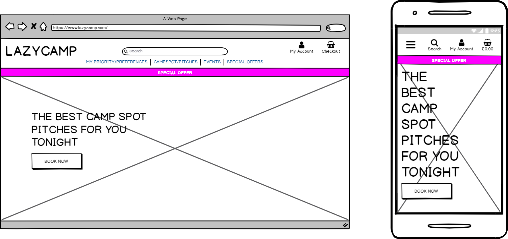

## Automated Testing
### Validation Services
The following validation services and linter were used to check the validity of the website code.

[W3C Markup Validation](https://validator.w3.org/) was used to validate HTML.

[W3C CSS validation](https://jigsaw.w3.org/css-validator/) was used to validate CSS.

[JSHint](https://jshint.com/) was used to validate JavaScript.

[Chrome Devtools](https://developers.google.com/web/tools/chrome-devtools/) to test responsivitiy throughout.

[Firefox Devtools](https://developer.mozilla.org/en-US/docs/Tools) to test responsivitiy throughout. 

[HTML and CSS Beautifier](https://www.freeformatter.com/html-formatter.html) use format selection in beautify code

[AutoPrefixer](https://autoprefixer.github.io/) -This project used AutoPrefixer to make sure the css code is valid for all browsers.

[Markdown live-preview](https://markdownlivepreview.com/) -This project used markdown previewer to check the rendering of the readme.md file content.

[PEP8 online](http://pep8online.com/)- Not secure but ok for testing console errors.
    
[VSC code extensions](https://code.visualstudio.com/)- To test code when gitpod was not working well.

[IDLE](https://www.python.org/)- to check python code
    


### Manual Testing

Below is a detailed account of all the manual testing that has been done to confirm all areas of the site work as expected.

Due to the incompatability between gitpod IDE and gmail all sent email manual tests could only be carried out once the project had been deployed.
FB messenger will not work in the IDE and needs to be deployed to test.

Aside from the email and messenger manual tests, all commits to the github repository was preceded by changes that had been tested and proved to run successfully in the browser.
After each new commit the deployed app was tested to check the changes were successful.

After each change proved to work well in a particular screen size responsive design manual tests were completed using both chrome and Firefox dev tools. Each test was carried out in both browsers in both local and deployed versions.

Periodically extensive manual testing was carried out using 2 desktop screen sizes, 3 laptops, 2 tablets and 4 different mobile phones. Knowledge that testing responsive design in dev tools is not always 100% accurate, true rendering on the physical devices was relied upon through development.  

#### Devices tested

##### Mobile phones

Samsung S9,
Iphone 6
Iphone7
Iphone 7S plus,
Sony XA42

##### Tablets tested

Ipad
LNBEI 10 inch Android tablet

##### Laptop tested

MacBook pro,
Sony Vaio
HP Pavillion DV6

##### Desktop 

(unbranded Windows 7 OS) with different monitors 21 and 27inch.

#### Browsers 
Between devices the browsers tested were as follows:
Google Chrome,
Opera,
Firefox,
Microsoft Edge,
Safari,
Android Brower,
Samsung Browser

wrote unitests which run successfully but I did not gain enough confidence in my ability to write automated tests to negate the need for the manual tests. 
I understand that automated tests and TDD and essential when numerous people are working on the same project but as the sole contributor to the project my preference was reliance on manual testing.
I also believe that in development work few customers are willing to pay for time taken to write the tests on their code so after grasping the basics of writing automated tests I concentrated efforts on user stories and testing that would reveal bugs the user will see when browsing. 

Travis. Having successfully run Travis using the old version of the Full stack Developer module, I noted that Travis was no longer included in the updated videos. After some issue with Travis continuing to run lazycamp instead of new-lazycamp respository and even when successfully switching, Travis reverted back and ran tests on old repository, I was advised by the tutors that Travis had been  deprecated along with the use of Django 1 in projects along with Travis.. 

### Final Testing before Submission.

#### Elements on every page

1. Navbar

* Click on Logo returns to home.
* Tests on both mobile menu dropdown icon and desktop dropdown menus all link to the correct page. 
* Confirm My account is visible and that when clicked the logged out the options "Register" and "Log in" are visible and that "Campspot Management", "My Profile" and "Log out" are not.
* When Logged in the site, confirm that options "Campspot Management", "My Profile" and "Log out" are visible and that "Register" and "Log in" are not.
* Add a booking to the session and, confirm that the total expenditure appears under the shopping icon with the correct price displayed in £ as a float with two decimal places.
* Delete all items from the booking, confirm that the price of £0.00 is displayed in the navbar.
* Click the "price" link in the navbar, confirm that booking is empty or that all bookings are listed. 
* In mobile versions search input bar is not dispayed until the search icon is clicked. 
* The input search box is  set up to drive traffic to the online booking section. Manual tests confirm that 
on each page in which it is displayed the search lists campspots available to book online. The best results are achieved by searching by Welsh County currently because all campspots added have one added. 
* Check that on the products.html page the search box is hidden on desktop versions.
* Check that on mobiles and tablets the search icon is displayed but that the placeholder notifies the divert to online booking. This may be disable following peer review if it is raised as a point of confusion. Previous testing by friends and family have not commented on this as. 

#### Home page (index.html)

1.  Hero Image displays well in all browsers on all screen sizes tested.
2.  Call to action Book Now button is obvious, well positioned and on click lists all the campspots that are available to book immediateley online. 

#### Campspot Page (campspot.html)

1. Sorting options

Select the different sorting options from the menu one by one, confirm that the campspots are sorted in the orders selected.

2. Campspot cards -available section

* Hover over product cards, confirm the hover effect works as expected on bottom button.
* Confirm that the link to campspot details works from both campspot image and Book online Now button. 
* Confirm that the photos, Location and prices displayed are correct.
* Confirm that all image sizes are correct.
* Check that no cards are misaligned. 
* Click multiple campspots, confirm that the user is taken to the correct campspot page if available.
* Check that when the category name is clicked that all other campspots in the same category are displayed with invitation to "Book Online Now".

2. Campspot cards - Not currently available section

* Check that all fully booked campspots (that have been unticked as False in Boolean add/edit campspot checkbox by admin or the user) are displayed in the currently unavailable section underneath all the available sites and marked as "Fully Booked".

* Check that all recently added campspots, by admin or authorised user have been added and are displayed in the currently unavailable section underneath all the available sites and marked as "Coming Soon".

* Check that there are no duplicates or missing products

#### Campspot Detail Page (campspot_detail.html)

* Click on image brings up large image in new tab.

* If logged in user is either a superuser or is the authorised site owner they will have the option to edit or delete. Check that the edit and delete coloured text is displayed when logged in. If they edit and delete text is visible, check that the edit campspot links to the correct campspot id. 

* If not logged in or on a campspot page for which you do not have the authority to edit or delete, check that the edit and delete options are not visible. 

* Check that the Number of adults and Number of nights input boxes move up and down as expected. 

* Check that the datepicker is revealed on click and the chosen date is selected.

* Click on Book Now button and the number of adults, date and number of nights selected is revealed in a success toast with the message "added date and campspot name to book. 

* If more than one booking is made check that they are all added in the campspot_detail booking success toast and that the total price is updated. 

* If more than one booking is made for the same campspot, ensure that these bookings are added together and reflect the sum of the two bookings. Check that this is revealed in the success toast. 

* Test that the keep looking link gives the option to add additional bookings.

* "check your date!" tooltip is revealed on hover over the book now button.

*  Check that the "Go to Secure Checkout" link on the success toast correctly renders the booking session on the book.html page.

#### Booking page (book.html)

* On the bookings page check

all details are correct

the image links to campspot_detail page
the remove option deletes the booking from session and page

the amend option deletes the booking and redirects the user to the same campspot and reminds the user to rebook in a toast

The two link to secure checkout or backwards to keep looking both take to the expected pages


#### Contact Page (contact.html)
* Go to the contact page from the Contact dropdown in the navigation menu. 

* Confirm that the contact form is laid out as expected.
* Confirm that for a logged in user the email address field has already been populated.


Confirm that for a user who is not logged in the email address field is blank.
Try to send the form with no fields filled in, confirm that the user is alerted to fill in the required fields.
Try to enter a non-email address into the email field, confirm that the user is alerted to fill in an email address.
Send a complete form, confirm that the message is sent to my email address with all the information included.


#### Product Page (product.html)

Check that the aim of the products page is immediately obvious. The products displayed on this page will differ seasonally. 
* Currently and in futures summer this page will promote scheduled events and campspots near festivals.

* In the Winter it will promote Christmas event and camping kits gifts
* In The Spring this page will promote camping kits and European events.
* In the Autumn this page will promote Southern Mediterranean festivals and events alongside European roadtrip and camping kits recommended for different climates. In British Summer camping in Greece, Southern Italy, Southern Spain and Croatia is not recommended by Lazycamp. 

1. Sorting options

Select the different sorting options from the menu one by one, confirm that the products are sorted in the orders selected.

2. Product cards

* Hover over product cards, confirm the hover effect works as expected on bottom button.
* Confirm that the link to product details works from both product image and Telephone number button. 
Once this site has working payment in place the telephone number will that if the product owner/supplier. 
* Confirm that the photos, Location and prices displayed are correct.
* Confirm that all image sizes are correct.
* Check that no cards are misaligned. 
* Click multiple products, confirm that the user is taken to the correct product page.
* Check that when the category name is clicked that all other products in the same category are displayed with invitation to "Book Online Now".
* Check that when the event date is clicked that all other products listed as events are displayed.

#### Product Detail Page (product_detail.html)

* Click on image brings up large image in new tab.

* Confirm that for a logged in user the email address field has already been populated.

* If logged in user is either a superuser or is the authorised site owner they will have the option to edit or delete. Check that the edit and delete coloured text is displayed when logged in. If they edit and delete text is visible, check that the edit product links to the correct product id. 

* If not logged in or on a product page for which you do not have the authority to edit or delete, check that the edit and delete options are not visible. 

* Test the product enquiry form reveals a toast with the success message "Your email was sent Successfully!" when completed and submitted. NOTE: this can only be tested in the deployed version due to gitpod and gmail incompatibility.

* Test the "Please fill in this field" tooltip is revealed if the email is attempted to be sent without completion of all the required fields.

* Test the links to the products.html Events and the separate link to campspots.html Online Camps bookings 


Bugs- 
The delete function is not working for the campspot unless superuser.
Check view and admin authorisation. 
may be incompatibility between campspots added in gitpod and in heroku. may be to access admin and remove all recently added campspots and products as first check.


### User Stories Testing

Bugs the display of datepicker in old safari version

the deleting of all products with the same id was an issue


Early development testing.


Responsive Design - Recipes for Recovery app is fully responsive;

Compatibility
To ensure a broad range of users can successfully use this site, I tested it across the 6 major browsers in desktop, tablet and mobile configuration. Different versions used by friends, family and other students. No issues.


Python extension for Visual Studio Code and Pylint-django was used to validate Python.


hello

In this section, you need to convince the assessor that you have conducted enough testing to legitimately believe that the site works well. Essentially, in this part you will want to go over all of your user stories from the UX section and ensure that they all work as intended, with the project providing an easy and straightforward way for the users to achieve their goals.

Whenever it is feasible, prefer to automate your tests, and if you've done so, provide a brief explanation of your approach, link to the test file(s) and explain how to run them.

For any scenarios that have not been automated, test the user stories manually and provide as much detail as is relevant. 
A particularly useful form for describing your testing process is via scenarios, such as:

Contact form:
Go to the "Contact Us" page
Try to submit the empty form and verify that an error message about the required fields appears
Try to submit the form with an invalid email address and verify that a relevant error message appears
Try to submit the form with all inputs valid and verify that a success message appears.
In addition, you should mention in this section how your project looks and works on different browsers and screen sizes.

You should also mention in this section any interesting bugs or problems you discovered during your testing, even if you haven't addressed them yet.

If this section grows too long, you may want to split it off into a separate file and link to it from here.





testing 
following Django test documentation,
I added a test to books.py which threw an error in the database.
I then added test database in lazycamp settings.py file 
This made changes
python3 manage.py test products --settings=lazycamp.test_settings
still had problems so I set up a separate test.settings.py file in product app to test the models function
I tested with self.name() and passed the test.py file. When the self.name() was commented out the test failed.
to test I ran command 
python3 manage.py test products --settings=lazycamp.test_settings in the terminal

gitpod /workspace/new-lazycamp/book $ python3 experiment.py 
gitpod /workspace/new-lazycamp/book $ python3 experiment.py 
7
gitpod /workspace/new-lazycamp/book $ python3 experiment.py 
7
gitpod /workspace/new-lazycamp/book $ python3 experiment.py 
8
gitpod /workspace/new-lazycamp/book $ python3 experiment.py 
8
Traceback (most recent call last):
  File "experiment.py", line 9, in <module>
    test()
  File "experiment.py", line 7, in test
    assert(add(3,4)==7)
AssertionError
gitpod /workspace/new-lazycamp/book $ python3 experiment.py 
7
gitpod /workspace/new-lazycamp/book $ cd ..
gitpod /workspace/new-lazycamp $ python3 manage.py test products
Creating test database for alias 'default'...
/workspace/.pip-modules/lib/python3.8/site-packages/django/db/backends/postgresql/base.py:294: RuntimeWarning: Normally Django will use a connection to the 'postgres' database to avoid running initialization queries against the production database when it's not needed (for example, when running tests). Django was unable to create a connection to the 'postgres' database and will use the first PostgreSQL database instead.
  warnings.warn(
Got an error creating the test database: permission denied to create database

gitpod /workspace/new-lazycamp $ python3 manage.py test products
Creating test database for alias 'default'...
/workspace/.pip-modules/lib/python3.8/site-packages/django/db/backends/postgresql/base.py:294: RuntimeWarning: Normally Django will use a connection to the 'postgres' database to avoid running initialization queries against the production database when it's not needed (for example, when running tests). Django was unable to create a connection to the 'postgres' database and will use the first PostgreSQL database instead.
  warnings.warn(
Got an error creating the test database: permission denied to create database

gitpod /workspace/new-lazycamp $ python3 manage.py test products
Creating test database for alias 'default'...
/workspace/.pip-modules/lib/python3.8/site-packages/django/db/backends/postgresql/base.py:294: RuntimeWarning: Normally Django will use a connection to the 'postgres' database to avoid running initialization queries against the production database when it's not needed (for example, when running tests). Django was unable to create a connection to the 'postgres' database and will use the first PostgreSQL database instead.
  warnings.warn(
Got an error creating the test database: permission denied to create database

gitpod /workspace/new-lazycamp $ python3 manage.py test products --settings=test_settings
Traceback (most recent call last):
  File "manage.py", line 21, in <module>
    main()
  File "manage.py", line 17, in main
    execute_from_command_line(sys.argv)
  File "/workspace/.pip-modules/lib/python3.8/site-packages/django/core/management/__init__.py", line 401, in execute_from_command_line
    utility.execute()
  File "/workspace/.pip-modules/lib/python3.8/site-packages/django/core/management/__init__.py", line 395, in execute
    self.fetch_command(subcommand).run_from_argv(self.argv)
  File "/workspace/.pip-modules/lib/python3.8/site-packages/django/core/management/commands/test.py", line 23, in run_from_argv
    super().run_from_argv(argv)
  File "/workspace/.pip-modules/lib/python3.8/site-packages/django/core/management/base.py", line 320, in run_from_argv
    parser = self.create_parser(argv[0], argv[1])
  File "/workspace/.pip-modules/lib/python3.8/site-packages/django/core/management/base.py", line 294, in create_parser
    self.add_arguments(parser)
  File "/workspace/.pip-modules/lib/python3.8/site-packages/django/core/management/commands/test.py", line 44, in add_arguments
    test_runner_class = get_runner(settings, self.test_runner)
  File "/workspace/.pip-modules/lib/python3.8/site-packages/django/test/utils.py", line 301, in get_runner
    test_runner_class = test_runner_class or settings.TEST_RUNNER
  File "/workspace/.pip-modules/lib/python3.8/site-packages/django/conf/__init__.py", line 76, in __getattr__
    self._setup(name)
  File "/workspace/.pip-modules/lib/python3.8/site-packages/django/conf/__init__.py", line 63, in _setup
    self._wrapped = Settings(settings_module)
  File "/workspace/.pip-modules/lib/python3.8/site-packages/django/conf/__init__.py", line 142, in __init__
    mod = importlib.import_module(self.SETTINGS_MODULE)
  File "/home/gitpod/.pyenv/versions/3.8.2/lib/python3.8/importlib/__init__.py", line 127, in import_module
    return _bootstrap._gcd_import(name[level:], package, level)
  File "<frozen importlib._bootstrap>", line 1014, in _gcd_import
  File "<frozen importlib._bootstrap>", line 991, in _find_and_load
  File "<frozen importlib._bootstrap>", line 973, in _find_and_load_unlocked
ModuleNotFoundError: No module named 'test_settings'
gitpod /workspace/new-lazycamp $ python3 manage.py test products --settings=lazycamp.test_settings
Creating test database for alias 'default'...
System check identified no issues (0 silenced).
.
----------------------------------------------------------------------
Ran 1 test in 0.004s

OK
Destroying test database for alias 'default'...
gitpod /workspace/new-lazycamp $ python3 manage.py test products --settings=test_settings
Traceback (most recent call last):
  File "manage.py", line 21, in <module>
    main()
  File "manage.py", line 17, in main
    execute_from_command_line(sys.argv)
  File "/workspace/.pip-modules/lib/python3.8/site-packages/django/core/management/__init__.py", line 401, in execute_from_command_line
    utility.execute()
  File "/workspace/.pip-modules/lib/python3.8/site-packages/django/core/management/__init__.py", line 395, in execute
    self.fetch_command(subcommand).run_from_argv(self.argv)
  File "/workspace/.pip-modules/lib/python3.8/site-packages/django/core/management/commands/test.py", line 23, in run_from_argv
    super().run_from_argv(argv)
  File "/workspace/.pip-modules/lib/python3.8/site-packages/django/core/management/base.py", line 320, in run_from_argv
    parser = self.create_parser(argv[0], argv[1])
  File "/workspace/.pip-modules/lib/python3.8/site-packages/django/core/management/base.py", line 294, in create_parser
    self.add_arguments(parser)
  File "/workspace/.pip-modules/lib/python3.8/site-packages/django/core/management/commands/test.py", line 44, in add_arguments
    test_runner_class = get_runner(settings, self.test_runner)
  File "/workspace/.pip-modules/lib/python3.8/site-packages/django/test/utils.py", line 301, in get_runner
    test_runner_class = test_runner_class or settings.TEST_RUNNER
  File "/workspace/.pip-modules/lib/python3.8/site-packages/django/conf/__init__.py", line 76, in __getattr__
    self._setup(name)
  File "/workspace/.pip-modules/lib/python3.8/site-packages/django/conf/__init__.py", line 63, in _setup
    self._wrapped = Settings(settings_module)
  File "/workspace/.pip-modules/lib/python3.8/site-packages/django/conf/__init__.py", line 142, in __init__
    mod = importlib.import_module(self.SETTINGS_MODULE)
  File "/home/gitpod/.pyenv/versions/3.8.2/lib/python3.8/importlib/__init__.py", line 127, in import_module
    return _bootstrap._gcd_import(name[level:], package, level)
  File "<frozen importlib._bootstrap>", line 1014, in _gcd_import
  File "<frozen importlib._bootstrap>", line 991, in _find_and_load
  File "<frozen importlib._bootstrap>", line 973, in _find_and_load_unlocked
ModuleNotFoundError: No module named 'test_settings'
gitpod /workspace/new-lazycamp $ python3 manage.py test products --settings=lazycamp.test_settings
Creating test database for alias 'default'...
System check identified no issues (0 silenced).
F
======================================================================
FAIL: test_get_friendly_name (products.tests.TestCategory)
----------------------------------------------------------------------
Traceback (most recent call last):
  File "/workspace/new-lazycamp/products/tests.py", line 14, in test_get_friendly_name
    self.assertEqual(cattwo.get_friendly_name(), 'cattwo')
AssertionError: '' != 'cattwo'
+ cattwo

----------------------------------------------------------------------
Ran 1 test in 0.004s

FAILED (failures=1)
Destroying test database for alias 'default'...
gitpod /workspace/new-lazycamp $ 
gitpod /workspace/new-lazycamp $ 
gitpod /workspace/new-lazycamp $ 
gitpod /workspace/new-lazycamp $ python3 manage.py test products --settings=lazycamp.test_settings
Creating test database for alias 'default'...
Traceback (most recent call last):
  File "/workspace/.pip-modules/lib/python3.8/site-packages/django/db/backends/utils.py", line 86, in _execute
    return self.cursor.execute(sql, params)
  File "/workspace/.pip-modules/lib/python3.8/site-packages/django/db/backends/sqlite3/base.py", line 396, in execute
    return Database.Cursor.execute(self, query, params)
sqlite3.OperationalError: no such column: products_product.owner_id

The above exception was the direct cause of the following exception:

Traceback (most recent call last):
  File "manage.py", line 21, in <module>
    main()
  File "manage.py", line 17, in main
    execute_from_command_line(sys.argv)
  File "/workspace/.pip-modules/lib/python3.8/site-packages/django/core/management/__init__.py", line 401, in execute_from_command_line
    utility.execute()
  File "/workspace/.pip-modules/lib/python3.8/site-packages/django/core/management/__init__.py", line 395, in execute
    self.fetch_command(subcommand).run_from_argv(self.argv)
  File "/workspace/.pip-modules/lib/python3.8/site-packages/django/core/management/commands/test.py", line 23, in run_from_argv
    super().run_from_argv(argv)
  File "/workspace/.pip-modules/lib/python3.8/site-packages/django/core/management/base.py", line 328, in run_from_argv
    self.execute(*args, **cmd_options)
  File "/workspace/.pip-modules/lib/python3.8/site-packages/django/core/management/base.py", line 369, in execute
    output = self.handle(*args, **options)
  File "/workspace/.pip-modules/lib/python3.8/site-packages/django/core/management/commands/test.py", line 53, in handle
    failures = test_runner.run_tests(test_labels)
  File "/workspace/.pip-modules/lib/python3.8/site-packages/django/test/runner.py", line 684, in run_tests
    old_config = self.setup_databases(aliases=databases)
  File "/workspace/.pip-modules/lib/python3.8/site-packages/django/test/runner.py", line 604, in setup_databases
    return _setup_databases(
  File "/workspace/.pip-modules/lib/python3.8/site-packages/django/test/utils.py", line 169, in setup_databases
    connection.creation.create_test_db(
  File "/workspace/.pip-modules/lib/python3.8/site-packages/django/db/backends/base/creation.py", line 80, in create_test_db
    self.connection._test_serialized_contents = self.serialize_db_to_string()
  File "/workspace/.pip-modules/lib/python3.8/site-packages/django/db/backends/base/creation.py", line 123, in serialize_db_to_string
    serializers.serialize("json", get_objects(), indent=None, stream=out)
  File "/workspace/.pip-modules/lib/python3.8/site-packages/django/core/serializers/__init__.py", line 128, in serialize
    s.serialize(queryset, **options)
  File "/workspace/.pip-modules/lib/python3.8/site-packages/django/core/serializers/base.py", line 90, in serialize
    for count, obj in enumerate(queryset, start=1):
  File "/workspace/.pip-modules/lib/python3.8/site-packages/django/db/backends/base/creation.py", line 120, in get_objects
    yield from queryset.iterator()
  File "/workspace/.pip-modules/lib/python3.8/site-packages/django/db/models/query.py", line 346, in _iterator
    yield from self._iterable_class(self, chunked_fetch=use_chunked_fetch, chunk_size=chunk_size)
  File "/workspace/.pip-modules/lib/python3.8/site-packages/django/db/models/query.py", line 57, in __iter__
    results = compiler.execute_sql(chunked_fetch=self.chunked_fetch, chunk_size=self.chunk_size)
  File "/workspace/.pip-modules/lib/python3.8/site-packages/django/db/models/sql/compiler.py", line 1151, in execute_sql
    cursor.execute(sql, params)
  File "/workspace/.pip-modules/lib/python3.8/site-packages/django/db/backends/utils.py", line 68, in execute
    return self._execute_with_wrappers(sql, params, many=False, executor=self._execute)
  File "/workspace/.pip-modules/lib/python3.8/site-packages/django/db/backends/utils.py", line 77, in _execute_with_wrappers
    return executor(sql, params, many, context)
  File "/workspace/.pip-modules/lib/python3.8/site-packages/django/db/backends/utils.py", line 86, in _execute
    return self.cursor.execute(sql, params)
  File "/workspace/.pip-modules/lib/python3.8/site-packages/django/db/utils.py", line 90, in __exit__
    raise dj_exc_value.with_traceback(traceback) from exc_value
  File "/workspace/.pip-modules/lib/python3.8/site-packages/django/db/backends/utils.py", line 86, in _execute
    return self.cursor.execute(sql, params)
  File "/workspace/.pip-modules/lib/python3.8/site-packages/django/db/backends/sqlite3/base.py", line 396, in execute
    return Database.Cursor.execute(self, query, params)
django.db.utils.OperationalError: no such column: products_product.owner_id
gitpod /workspace/new-lazycamp $ python3 manage.py makemigrations --dry-run
Migrations for 'products':
  products/migrations/0008_product_owner.py
    - Add field owner to product
gitpod /workspace/new-lazycamp $ python3 manage.py makemigrations
You are trying to add a non-nullable field 'owner' to product without a default; we can't do that (the database needs something to populate existing rows).
Please select a fix:
 1) Provide a one-off default now (will be set on all existing rows with a null value for this column)
 2) Quit, and let me add a default in models.py
Select an option: 2
gitpod /workspace/new-lazycamp $ python3 manage.py makemigrations
You are trying to add a non-nullable field 'owner' to product without a default; we can't do that (the database needs something to populate existing rows).
Please select a fix:
 1) Provide a one-off default now (will be set on all existing rows with a null value for this column)
 2) Quit, and let me add a default in models.py
Select an option: 2
gitpod /workspace/new-lazycamp $ python3 manage.py makemigrations
Migrations for 'products':
  products/migrations/0008_product_owner.py
    - Add field owner to product
gitpod /workspace/new-lazycamp $ python3 manage.py migrate
Operations to perform:
  Apply all migrations: account, admin, auth, checkout, contenttypes, products, profiles, sessions, sites, socialaccount
Running migrations:
  Applying products.0008_product_owner... OK
gitpod /workspace/new-lazycamp $ python3 manage.py test products --settings=lazycamp.test_settings
Creating test database for alias 'default'...
System check identified no issues (0 silenced).
.
----------------------------------------------------------------------
Ran 1 test in 0.004s

OK
Destroying test database for alias 'default'...
gitpod /workspace/new-lazycamp $ 


Django's built-in testing framework

python3 manage.py test

checks all of the apps for filenames that begin with the word test and runs all of the methods in that file that begin with test_


travis 
[](https://travis-ci.org/samathaluca/new-lazycamp)


# LaZy Camp
## Lazy Camp
###### Lazy Camp
<hr>

*  Item 1
*  Item 2
*  Item 2a
*  Item 2b

1. Item 1
2. Item 2
3. Item 3
 * Item 3a
 * Item 3b

As Grace Hopper said:
> I’ve always been more interested
> in the future than in the past.

\*literal asterisks\*

```javascript```


Format: 

https://new-lazycamp.herokuapp.com/ - automatic!
[GitHub](https://new-lazycamp.herokuapp.com/)

*This text will be italic*
_This will also be italic_
**This text will be bold**
__This will also be bold__
*You **can** combine them*

# LaZy Camp

<hr>

The spontaneous campspot booking app.
https://new-lazycamp.herokuapp.com/ - automatic!
[Milestone Project4 - Lazycamp](https://new-lazycamp.herokuapp.com/)

## Project purpose

<hr>

Camping on the spur of the moment is currently very difficult unless you are a seasoned camper who may and familiar with the area you want to visit.
Even the large caravan and camping clubs either discourage last minute bookings by making it difficult or insist on arrival times that do not suit everybody.
The freedom of the open road and the wonderment of spontaneity can be exhilerating. 
Currently 12% of campers do not book ahead, blaming the weather. 
In summer 2019, I drove to from Manchester in the UK to Mainland Greece then on to the Greek Islands. Booking camspites along the way was too difficult. One night my son and I were scaling a fence with our tents and sleeping bags.
Another night I accidently camped on a communal residential lawn which has once been a campsite but was then private property. I was woke up by an angry chalet owner insisting I was trespassing.
Lazycamp is a next generation, user led, fast campspot booking system, hosting microcampsites that would be very difficult to find otherwise.

This project will roll out in Wales and Scotland first. In Scotland the number of tourists in the summer months excedes the number of overnight accommodation so visitors who are not very organised can even find themselves sleeping in police cells overnight.
Because the camping season in the UK is so short campsites need to fill their sites to be viable. Lazycamp will fill last minute spots and cancellations. 

UX
Use this section to provide insight into your UX process, focusing on who this website is for, what it is that they want to achieve and how your project is the best way to help them achieve these things.

In particular, as part of this section we recommend that you provide a list of User Stories, with the following general structure:

As a user type, I want to perform an action, so that I can achieve a goal.
This section is also where you would share links to any wireframes, mockups, diagrams etc. that you created as part of the design process. These files should themselves either be included as a pdf file in the project itself (in an separate directory), or just hosted elsewhere online and can be in any format that is viewable inside the browser.

Features
In this section, you should go over the different parts of your project, and describe each in a sentence or so.

Existing Features
Feature 1 - allows users X to achieve Y, by having them fill out Z
...
For some/all of your features, you may choose to reference the specific project files that implement them, although this is entirely optional.

In addition, you may also use this section to discuss plans for additional features to be implemented in the future:

Features Left to Implement
Another feature idea
Technologies Used
In this section, you should mention all of the languages, frameworks, libraries, and any other tools that you have used to construct this project. For each, provide its name, a link to its official site and a short sentence of why it was used.

JQuery
The project uses JQuery to simplify DOM manipulation.
Testing
In this section, you need to convince the assessor that you have conducted enough testing to legitimately believe that the site works well. Essentially, in this part you will want to go over all of your user stories from the UX section and ensure that they all work as intended, with the project providing an easy and straightforward way for the users to achieve their goals.

Whenever it is feasible, prefer to automate your tests, and if you've done so, provide a brief explanation of your approach, link to the test file(s) and explain how to run them.

For any scenarios that have not been automated, test the user stories manually and provide as much detail as is relevant. A particularly useful form for describing your testing process is via scenarios, such as:

Contact form:
Go to the "Contact Us" page
Try to submit the empty form and verify that an error message about the required fields appears
Try to submit the form with an invalid email address and verify that a relevant error message appears
Try to submit the form with all inputs valid and verify that a success message appears.
In addition, you should mention in this section how your project looks and works on different browsers and screen sizes.

You should also mention in this section any interesting bugs or problems you discovered during your testing, even if you haven't addressed them yet.

If this section grows too long, you may want to split it off into a separate file and link to it from here.

Deployment
This section should describe the process you went through to deploy the project to a hosting platform (e.g. GitHub Pages or Heroku).

In particular, you should provide all details of the differences between the deployed version and the development version, if any, including:

Different values for environment variables (Heroku Config Vars)?
Different configuration files?
Separate git branch?
In addition, if it is not obvious, you should also describe how to run your code locally.

Credits
Content
The text for section Y was copied from the Wikipedia article Z
Media
The photos used in this site were obtained from ...
Acknowledgements
I received inspiration for this project from X


Lazy camp - Last minute campspot booking app.
Link to Milestone Project 4

Project purpose

Camping on the spur of the moment is currently very difficult unless you are a seasoned camper who may or not be familiar with the area they want to visit.
Even the large caravan and camping clubs either discourage last minute bookings by making it difficult or insist on arrival times that do not suit everybody.
The freedom of the open road and the wonderment of spontaneity can be exhilerating. 

This project will roll out in Scotland first where the number of tourists in the summer months excedes the number of overnight accommodation so visitors who are not very organised can even find themselves sleeping in police cells overnight.


Quick guide
Home Page
About Page
Campspots Page
Individual Campspot Page
Register Page
Login Page
User Dashboard

To Add
Enquiry and contact PageBlog
Idea Page
Testiminial Page
Checkout Page


Ux
User stories
As a user I expect to be able to quickly find the nearest pitch/ site or spot where I can safely camp for the night.

As a user I may have needs or preferences that I want to be able to prioritise in a search for example, pets, car space, public transport, shower, electricity, local amenities.

As I user I want to know if the site is quiet, lively, family oriented, waterside, farm, wood, mountain etc.

As I user I want to know the price I will need to pay and a big advantage will be to prepay so that I can arrive when I want and know my place is secured.

As a user I want to be able to access the pitch normal hours and spontaneously 

As I user I want to ensure that the site participation is current and that I will have access and knowledge of where to go exactly.

I do not want to be given outdated event or pitch information. Maybe a link to check uptodate bus routes or travel info or weather forecast in the area.

I want to know a basic price and what will cost me extra. Do i need £1 coins for on site facilities. 

As a user I may want to be able to rent or buy a basic kit so I do not have to preplan my trip and buy camping stuff I may only use once.

As I user I may want to try camping for the first time with tips and ideas and to make my experience as comfortable as possible using know how from seasoned and well travelled campers

As a user I may need local information e.g. scottish midges, noisy frogs, local early cockerel or noisy dawn chorus, farm animal smells etc,

As a user I would like a profile of previous bookings and to find them easily. 

I would like to a very simple login process. I would like password reset . Ideally I would like to login through social media. 

I want to see images then reviews and other user images.

I may enjoy a blog or chatroom to help get ideas or make plans? 

I want my payment to be made easily and securely. I want email Acknowledgements

I would like model and messages then email confirmation. 

If I am camping my phone may not be charged and I am unlikely to have been able to rpint my booking so I would like my email address and name to be evidence enough to the business user .

I want flexibility and maybe a credit offer if I can not make my booking. 

As a user I wold like to be able to write a review and add images. 

As a user I would like to read how other users got there and found it. How they slept is important. did they feel secure. 

As a user I would like to know what is closest to my ideal spot if there are no ideal spots. for example i have 2 children and a dog so it must be a child and pet friendly site but I may be willing to park a distance away from the pitch or do without electric if needed. 

As a user organiser I want to be able to promote and camping event. 


I want my event to be evident closer to the time and be removed when the times has past.


I will want to add then amend possibly delete my events.

As a user org I may want to offer a limited number of places and show count down.

As a business user i would like to be able to promote my last spots until the last minute.

As a business user I do not want to

I will want to easily turn the availability on and off with immediate effect. 

I want to be able to set a limit of pitches and once exceded no more be accepted. 

I will want to add then amend possibly delete my pitches to manage customer expectations and minimse the effort of having people arrive late.

I want to be able to get an email each time I have a booking or log on to my profile to see who and when users will be arriving each day. 

I want to be able to offer extras that can be paid for locally or on the site. 

As a user I want to know how much I am owed from my profile.

AS a user I do not want to contacted outside hours and so customers can autofind info on the site for late arrival policy etc. or I want to charge extra for late arrivals. 

As a business user I may offer a seperate late arrival area or a late arrival area as a trial only 

Lazy camp is for the spontaneous. Last minute plans to fit the weather or the call of the wild.

Coming out of the covid pandemic travellers may not wish to book abroad and may be keen to get away for a few days. If i can be ready for the end of lockdown the site may get a lot of interest. 

The scottish 500 is an aspirational road trip with world class sunsets, wild beaches, cliffs, accessible islands with turquoise seas, mountains, culture, heritage, castles and legend. 
To prebook this is tricky and limits the enjoyment of the trip.
A last minute decision to divert or stay an extra night is bliss. lazy camp allows for this.

Many people do not know how to prepare for a camping trip and so never experience the freedom it offers. Lazy camp will offer a set up ready to arrive with no kit and leave with your back back.

Late arrival is currently difficult. This will be one of the features on offer. 24/7 pitches will be available

On the road trip to greece last summer we often found ourselves scaling fences with locked gates. Lazy camp will offer spots on the edge of campsites where late arrival is possible.


All visitors to the site will expect/want/need:


Professionals/Business Users


Feedback and comments from user groups


Development planes

The strategy plane- is this still in favour to go for 5 planes?
The scope plane
Structure
Kkeleton
surface

Wireframes


Defensive design planning

DATABASE

Features and design elements

index.html page features

Future features


Tech Used
HTML5 Semantic markup language as the shell of the site.
CSS -This was used to style the elements of the HTML code.
MATERIALIZE -HTML forms, cards, templates with nav bar, buttons etc. js materiliaze
PYTHON3
FLASK Framework to construct and render pages.
MONGODB_ATLAS for nonsql database
GITPOD IDE
HEROKU - deployment
GITHUB - used for version control
VSC used to help format and beautify the code using extensions. Also as a back up IDE when internet access was limited.
GIMP -This was used for resizing, cropping, fading and changing images to fit the site.
PHOTOSHOP - For digital image production.
FAVICON- used to develop tab icons which were replaced by photoshop 64px by 64px image.
MARKDOWN -Language for Readme.md file
PYMONGO - to make communication between Python and MongoDB possible
[PIP and Pypi libraries]
JQUERY -This added functionality to the site e.g. navigation toggle.
JINJA - to simplify displaying data from the backend of this project smoothly and effectively in html.
BEAUTIFIER - to check code and improve code readability.
BALSAMIQ - wireframe design
HEX CODES - different colours experimentation. 22, GOOGLE FONTS
Testing
Chrome Devtools
HTML Validator
CSS Validator
HTML and CSS Beautifier use format selection in beautify code
AutoPrefixer -This project used AutoPrefixer to make sure the css code is valid for all browsers.
Markdown live-preview -This project used markdown previewer to check the rendering of the readme.md file content.
PEP8 online- Not secure but ok for testing console errors.
Gitpod- IDE used throughout the project.
VSC code extensions- To test code when gitpod was not working well.
IDLE- to check python code
Javascript- Tested to check Materialize initialization.
Early development testing.


Responsive Design - Recipes for Recovery app is fully responsive;


Compatibility
To ensure a broad range of users can successfully use this site, I tested it across the 6 major browsers in desktop, tablet and mobile configuration. Different versions used by friends, family and other students. No issues.

Chrome

Edge

Firefox

Safari

Opera

Devices tested
Mobile phones

Samsung S9,
Iphone 6
Iphone7
Iphone 7S plus,
Sony XA42
Tablets tested

Ipad = LNBEI 10 inch Android tablet
Laptop tested

MacBook pro,
Sony Vaio
HP Pavillion DV6
Desktop (unbranded Windows 7 OS) with different monitors 21 and 27inch.

Version control and Heroku Deployment
For version control Github has been used. Github is a distributed Version Control Systems (DVCSs) recommended by Code Institute which ensures we have a store of all significant changes made during development. Using Gitpod alongside Github had major advantages in terms of how easy it was to stage, commit and push versions but I did get confused in the early days of using Gitpod because opening up previous versions and trying to save them did not commit as the most recent version which led to a number of different worskpaces for the same repository listed in gitpod.io associated with one repository.

I found it easier to copy and paste previous changes in to the most recent worksspace which left clean development path releative to timeline.

In summary, gitpod offers all opened versions of a respository within https://gitpod.io/workspaces/. There is one master and numerous detached, previous versions that have been opened. I only worked within master after losing track of some changes within previous versions.

I was careful to use commit messages that I could find again if needed. I did notice some students had 800-900 commits for their projects. I have only made commits when there is a change made I believe is a step forward in development. The most basic changes such as, spellings, form questions, colour tests, link changes etc. have not been saved individually because I use version control as a working tool and want it as lean and easy to find amendments as possible.

As detailed below I moved from version control and deployment via the command line terminal to setting up IDE to DVSC commits with automated deployment. This made version control and deployment effortless.

Github repository

Milestone 3 final deployed app

Github initial commit to repository and first heroku build were created on the same day. Version control and Heroku deployment were initially done separately in the command line (Method one below) then as better understanding of gitpod and heroku was grasped, all significant version changes were pushed to github and automatically deployed to heroku once the app was connected to the github repository (Method two below).

Version control was relied upon throughout the development process. A number of times changes were aborted and an old version was reverted to. For example github commit 50 reverted to app.py in commit 44.

Many times previous version code was reused. This was particularly useful when gitpod refresh was not working as expected which created unexpected issues. For example, styling did not appear until 90 minutes after the change had been made or was only noticeable in the deployed app.

In summary, two methods of deployment were used. Both were successful but the second method was favoured because it allowed version control and deployment at the same time.

To deploy Recipes for Recovery app to heroku, the following steps were taken:

Method one . Initially, for each version I initially pushed separately to either github and and heroku.
I began deployment via the CLI in gitpod workspace terminal using the following commands until I saw the build log in heroku or github repository showed successful deployment and/or new version commit:

npm install -g heroku

heroku login -i

git status

git add

git commit -m "initial commit"

git remote add heroku https://git.heroku.com/fallen-but-not-broken

git push -u heroku master

git remote -v

pip3 freeze --local > requirements.txt

echo web: python app.py > Procfile

Initially I separately added to the github repository.

git add git commit -m "" git remote add (my repository named fallen) git push -u origin master

Method two
When I tried to work out how to combine git push and heroku deploy I worked out a simpler method possible using the SOURCE CONTROL:Git branch icon in the gitpod workspace.

This was achieved by connecting heroku to github and selecting automatic deploys.

Github and heroku connected

From that point on gitpod push to github automatically deployed to heroku and so github version control and heroku build log mirrored each other perfectly.

Gitpod and github/heroku commit/deploy

click on branch icon
Hover on changes and click + (plus) to stage changes
Type commit message
Hover on tick reveals commit tooltip. Click to commit.
Hover on more actions '...' click reveals dropdown with push option. Click on push.
Check that Build has succeeded in heroku dashboard. It may take a couple of minutes. Open app to check changes. Do not forget to refresh. Often F5 is needed to see the recent changes in the deployed app.

Step by Step deployment from fresh gitpod terminal workspace would be.

Checked requirements.txt file using the terminal command pip freeze > requirements.txt.

Checked Procfile with the terminal command echo web: python app.py > Procfile.

Stage changes in gitpod. Write a commit message, click on the tick icon then push to Github.

Create a new app on the Heroku website by clicking the "New" button in your dashboard. Give it a name and set the region to Europe.

From the heroku dashboard of your newly created application, click on "Deploy" > "Deployment method" and select GitHub.

Confirm the linking of the heroku app to the correct GitHub repository.

In the heroku dashboard for the application, click on "Settings" > "Reveal Config Vars".

Set the following config vars:

Key Value

IP 0.0.0.0

MONGO_URI mongodb+srv://:@<cluster_name>-qtxun.mongodb.net/<database_name>?retryWrites=true&w=majority

PORT 5000

In the heroku dashboard, click "Deploy".

In the "Manual Deployment" section of this page, made sure the master branch is selected and then click "Deploy Branch".

The site is now successfully deployed.

Environment variables, dependencies and any other differences between the dev and live versions.
The only difference is that the MongoDb key values are stored in env.py for dev version (.gitignore file ensures MongoDB password is not revealed on github). For the live version MongoDB key values are stored and accessed in the config vars.

Credits
Content
The recovery recipes (recovery stories) were written anonymously by people in recovery. All other content is original.

Media
The photograph images used in this site were mostly obtained from pixabay.com. All the wok/fire digital images and logos were created to bespoke spec, using photoshop, by Paris Lyons. The photograph/digital mix images were created using the image manipulation program GIMP (gimp.org) from google and pixabay images origins.

Inspiration
I received inspiration for this project after years personally witnessing the struggle people have to find recovery from addiction, in all of the many forms. The prognosis for recovery is very poor and data collection to find out why, could make a difference. A few days before submitting my final project, my neighbour set his house on fire cooking while drunk. He has been trying to stop drinking for many years. After hearing his smoke alarms through the walls, my son and I looked over the fence and saw his house filled with smoke. My neighbour had collapsed and was lying next to the fire unconscious. I called 999 and watched 3 fire engines, 2 ambulances and 2 police cars arrive. The fire officers bust his door down and prevented our adjoining houses burning to the ground. My neighbour called me the next day and could not remember anything other than getting a taxi back from the hospital and going to buy a morning bottle of vodka. Different methods need to be developed to help and I believe the more stories we can collect from people who have recovered, the more chance they is of alleviating suffering within this vunerable group.

Acknowledgements
Paris Lyons for the digital images, My mentor Brian Macharia for his thorough checks and clear direction. Thank you for the invaluable new screen share sessions offered by Code institute. Helpful when I hit a brick wall in my understanding a) when I was new to gitpod with Michael and Luca b) getting my update function working with Tim. The tutor team support has been excellent. Knowing I can access Michael very early and Anna in the evenings has meant no problem has gone unsolved for long. Slack has been an asset and the final decision making help at the end the final push. I looked at other students work and particularly liked Shane Muirhead's design. (https://milestone4.herokuapp.com). My early balsamiq designes were inspired by this project. I did experiment using some of shane's code but it did contain some of the materiliaze card bug issues on zoom I mention in the responsiveness section. His recipe card page layout inspired my story_detail.html page but he hard coded his recipes and mine were pulled from the details in the database.

Submission
Assessment Criteria review
I have aimed to fulfil all the assessment criteria below to a standard beyond that expected. Final review and readnme checks done. Your Data Centric Development project will be assessed based on the following criteria:

Usability and Visual Impact:

Project Purpose, UX design, Suitability for purpose, Navigation, Ease of use, Information Architecture, Defensive Design,

Layout and Visual Impact:

Responsive Design, Image Presentation, Colour scheme and typography

Code Quality:

Appropriate use of HTML, Appropriate use of CSS, Appropriate use of Python, Appropriate use of the template language

Software Development practices:

Directory Structure and File Naming, Version control, Testing implementation, Testing write-up, Readme file, Comments, Data store integration, Deployment implementation, Deployment write-up


**April 16 2020:** The template now automatically installs MySQL instead of relying on the Gitpod MySQL image. The message about a Python linter not being installed has been dealt with, and the set-up files are now hidden in the Gitpod file explorer.

**April 13 2020:** Added the _Prettier_ code beautifier extension instead of the code formatter built-in to Gitpod.

**February 2020:** The initialisation files now _do not_ auto-delete. They will remain in your project. You can safely ignore them. They just make sure that your workspace is configured correctly each time you open it. It will also prevent the Gitpod configuration popup from appearing.

**December 2019:** Added Eventyret's Bootstrap 4 extension. Type `!bscdn` in a HTML file to add the Bootstrap boilerplate. Check out the <a href="https://github.com/Eventyret/vscode-bcdn" target="_blank">README.md file at the official repo</a> for more options.


`python3 -m http.server`

`python3 app.py`

--------

Happy coding!

newcreate appconnect to gitfound the correct rep and added.
added auto deploy
then added manual deploy 

added secret key to config vars

remember disable_collectstatic stopped build so added 

the added postgres through resources tab at top and added in gitpod. 

settings.py file
add at top import dj_database_url

ALLOWED_HOSTS = [os.environ.get("C9_HOSTNAME"), 'localhost', 'lazycamp.herokuapp.com']

plus provision postgres from dashboard


added pip3 install dj_database_url abd psycho-binary

add gunicorn

add procfile to tell heroku to create a web dyno

app was present but not running properly

run show migrations then migrate

python3 manage.py loaddata categories

python3 manage.py loaddata products


testing 
following Django test documentation,
I added a test to books.py which threw an error in the database.
I then added test database in lazycamp settings.py file 
This made changes
python3 manage.py test products --settings=lazycamp.test_settings
still had problems so I set up a separate test.settings.py file in product app to test the models function
I tested with self.name() and passed the test.py file. When the self.name() was commented out the test failed.
to test I ran command 
python3 manage.py test products --settings=lazycamp.test_settings in the terminal

gitpod /workspace/new-lazycamp/book $ python3 experiment.py 
gitpod /workspace/new-lazycamp/book $ python3 experiment.py 
7
gitpod /workspace/new-lazycamp/book $ python3 experiment.py 
7
gitpod /workspace/new-lazycamp/book $ python3 experiment.py 
8
gitpod /workspace/new-lazycamp/book $ python3 experiment.py 
8
Traceback (most recent call last):
  File "experiment.py", line 9, in <module>
    test()
  File "experiment.py", line 7, in test
    assert(add(3,4)==7)
AssertionError
gitpod /workspace/new-lazycamp/book $ python3 experiment.py 
7
gitpod /workspace/new-lazycamp/book $ cd ..
gitpod /workspace/new-lazycamp $ python3 manage.py test products
Creating test database for alias 'default'...
/workspace/.pip-modules/lib/python3.8/site-packages/django/db/backends/postgresql/base.py:294: RuntimeWarning: Normally Django will use a connection to the 'postgres' database to avoid running initialization queries against the production database when it's not needed (for example, when running tests). Django was unable to create a connection to the 'postgres' database and will use the first PostgreSQL database instead.
  warnings.warn(
Got an error creating the test database: permission denied to create database

gitpod /workspace/new-lazycamp $ python3 manage.py test products
Creating test database for alias 'default'...
/workspace/.pip-modules/lib/python3.8/site-packages/django/db/backends/postgresql/base.py:294: RuntimeWarning: Normally Django will use a connection to the 'postgres' database to avoid running initialization queries against the production database when it's not needed (for example, when running tests). Django was unable to create a connection to the 'postgres' database and will use the first PostgreSQL database instead.
  warnings.warn(
Got an error creating the test database: permission denied to create database

gitpod /workspace/new-lazycamp $ python3 manage.py test products
Creating test database for alias 'default'...
/workspace/.pip-modules/lib/python3.8/site-packages/django/db/backends/postgresql/base.py:294: RuntimeWarning: Normally Django will use a connection to the 'postgres' database to avoid running initialization queries against the production database when it's not needed (for example, when running tests). Django was unable to create a connection to the 'postgres' database and will use the first PostgreSQL database instead.
  warnings.warn(
Got an error creating the test database: permission denied to create database

gitpod /workspace/new-lazycamp $ python3 manage.py test products --settings=test_settings
Traceback (most recent call last):
  File "manage.py", line 21, in <module>
    main()
  File "manage.py", line 17, in main
    execute_from_command_line(sys.argv)
  File "/workspace/.pip-modules/lib/python3.8/site-packages/django/core/management/__init__.py", line 401, in execute_from_command_line
    utility.execute()
  File "/workspace/.pip-modules/lib/python3.8/site-packages/django/core/management/__init__.py", line 395, in execute
    self.fetch_command(subcommand).run_from_argv(self.argv)
  File "/workspace/.pip-modules/lib/python3.8/site-packages/django/core/management/commands/test.py", line 23, in run_from_argv
    super().run_from_argv(argv)
  File "/workspace/.pip-modules/lib/python3.8/site-packages/django/core/management/base.py", line 320, in run_from_argv
    parser = self.create_parser(argv[0], argv[1])
  File "/workspace/.pip-modules/lib/python3.8/site-packages/django/core/management/base.py", line 294, in create_parser
    self.add_arguments(parser)
  File "/workspace/.pip-modules/lib/python3.8/site-packages/django/core/management/commands/test.py", line 44, in add_arguments
    test_runner_class = get_runner(settings, self.test_runner)
  File "/workspace/.pip-modules/lib/python3.8/site-packages/django/test/utils.py", line 301, in get_runner
    test_runner_class = test_runner_class or settings.TEST_RUNNER
  File "/workspace/.pip-modules/lib/python3.8/site-packages/django/conf/__init__.py", line 76, in __getattr__
    self._setup(name)
  File "/workspace/.pip-modules/lib/python3.8/site-packages/django/conf/__init__.py", line 63, in _setup
    self._wrapped = Settings(settings_module)
  File "/workspace/.pip-modules/lib/python3.8/site-packages/django/conf/__init__.py", line 142, in __init__
    mod = importlib.import_module(self.SETTINGS_MODULE)
  File "/home/gitpod/.pyenv/versions/3.8.2/lib/python3.8/importlib/__init__.py", line 127, in import_module
    return _bootstrap._gcd_import(name[level:], package, level)
  File "<frozen importlib._bootstrap>", line 1014, in _gcd_import
  File "<frozen importlib._bootstrap>", line 991, in _find_and_load
  File "<frozen importlib._bootstrap>", line 973, in _find_and_load_unlocked
ModuleNotFoundError: No module named 'test_settings'
gitpod /workspace/new-lazycamp $ python3 manage.py test products --settings=lazycamp.test_settings
Creating test database for alias 'default'...
System check identified no issues (0 silenced).
.
----------------------------------------------------------------------
Ran 1 test in 0.004s

OK
Destroying test database for alias 'default'...
gitpod /workspace/new-lazycamp $ python3 manage.py test products --settings=test_settings
Traceback (most recent call last):
  File "manage.py", line 21, in <module>
    main()
  File "manage.py", line 17, in main
    execute_from_command_line(sys.argv)
  File "/workspace/.pip-modules/lib/python3.8/site-packages/django/core/management/__init__.py", line 401, in execute_from_command_line
    utility.execute()
  File "/workspace/.pip-modules/lib/python3.8/site-packages/django/core/management/__init__.py", line 395, in execute
    self.fetch_command(subcommand).run_from_argv(self.argv)
  File "/workspace/.pip-modules/lib/python3.8/site-packages/django/core/management/commands/test.py", line 23, in run_from_argv
    super().run_from_argv(argv)
  File "/workspace/.pip-modules/lib/python3.8/site-packages/django/core/management/base.py", line 320, in run_from_argv
    parser = self.create_parser(argv[0], argv[1])
  File "/workspace/.pip-modules/lib/python3.8/site-packages/django/core/management/base.py", line 294, in create_parser
    self.add_arguments(parser)
  File "/workspace/.pip-modules/lib/python3.8/site-packages/django/core/management/commands/test.py", line 44, in add_arguments
    test_runner_class = get_runner(settings, self.test_runner)
  File "/workspace/.pip-modules/lib/python3.8/site-packages/django/test/utils.py", line 301, in get_runner
    test_runner_class = test_runner_class or settings.TEST_RUNNER
  File "/workspace/.pip-modules/lib/python3.8/site-packages/django/conf/__init__.py", line 76, in __getattr__
    self._setup(name)
  File "/workspace/.pip-modules/lib/python3.8/site-packages/django/conf/__init__.py", line 63, in _setup
    self._wrapped = Settings(settings_module)
  File "/workspace/.pip-modules/lib/python3.8/site-packages/django/conf/__init__.py", line 142, in __init__
    mod = importlib.import_module(self.SETTINGS_MODULE)
  File "/home/gitpod/.pyenv/versions/3.8.2/lib/python3.8/importlib/__init__.py", line 127, in import_module
    return _bootstrap._gcd_import(name[level:], package, level)
  File "<frozen importlib._bootstrap>", line 1014, in _gcd_import
  File "<frozen importlib._bootstrap>", line 991, in _find_and_load
  File "<frozen importlib._bootstrap>", line 973, in _find_and_load_unlocked
ModuleNotFoundError: No module named 'test_settings'
gitpod /workspace/new-lazycamp $ python3 manage.py test products --settings=lazycamp.test_settings
Creating test database for alias 'default'...
System check identified no issues (0 silenced).
F
======================================================================
FAIL: test_get_friendly_name (products.tests.TestCategory)
----------------------------------------------------------------------
Traceback (most recent call last):
  File "/workspace/new-lazycamp/products/tests.py", line 14, in test_get_friendly_name
    self.assertEqual(cattwo.get_friendly_name(), 'cattwo')
AssertionError: '' != 'cattwo'
+ cattwo

----------------------------------------------------------------------
Ran 1 test in 0.004s

FAILED (failures=1)
Destroying test database for alias 'default'...
gitpod /workspace/new-lazycamp $ 
gitpod /workspace/new-lazycamp $ 
gitpod /workspace/new-lazycamp $ 
gitpod /workspace/new-lazycamp $ python3 manage.py test products --settings=lazycamp.test_settings
Creating test database for alias 'default'...
Traceback (most recent call last):
  File "/workspace/.pip-modules/lib/python3.8/site-packages/django/db/backends/utils.py", line 86, in _execute
    return self.cursor.execute(sql, params)
  File "/workspace/.pip-modules/lib/python3.8/site-packages/django/db/backends/sqlite3/base.py", line 396, in execute
    return Database.Cursor.execute(self, query, params)
sqlite3.OperationalError: no such column: products_product.owner_id

The above exception was the direct cause of the following exception:

Traceback (most recent call last):
  File "manage.py", line 21, in <module>
    main()
  File "manage.py", line 17, in main
    execute_from_command_line(sys.argv)
  File "/workspace/.pip-modules/lib/python3.8/site-packages/django/core/management/__init__.py", line 401, in execute_from_command_line
    utility.execute()
  File "/workspace/.pip-modules/lib/python3.8/site-packages/django/core/management/__init__.py", line 395, in execute
    self.fetch_command(subcommand).run_from_argv(self.argv)
  File "/workspace/.pip-modules/lib/python3.8/site-packages/django/core/management/commands/test.py", line 23, in run_from_argv
    super().run_from_argv(argv)
  File "/workspace/.pip-modules/lib/python3.8/site-packages/django/core/management/base.py", line 328, in run_from_argv
    self.execute(*args, **cmd_options)
  File "/workspace/.pip-modules/lib/python3.8/site-packages/django/core/management/base.py", line 369, in execute
    output = self.handle(*args, **options)
  File "/workspace/.pip-modules/lib/python3.8/site-packages/django/core/management/commands/test.py", line 53, in handle
    failures = test_runner.run_tests(test_labels)
  File "/workspace/.pip-modules/lib/python3.8/site-packages/django/test/runner.py", line 684, in run_tests
    old_config = self.setup_databases(aliases=databases)
  File "/workspace/.pip-modules/lib/python3.8/site-packages/django/test/runner.py", line 604, in setup_databases
    return _setup_databases(
  File "/workspace/.pip-modules/lib/python3.8/site-packages/django/test/utils.py", line 169, in setup_databases
    connection.creation.create_test_db(
  File "/workspace/.pip-modules/lib/python3.8/site-packages/django/db/backends/base/creation.py", line 80, in create_test_db
    self.connection._test_serialized_contents = self.serialize_db_to_string()
  File "/workspace/.pip-modules/lib/python3.8/site-packages/django/db/backends/base/creation.py", line 123, in serialize_db_to_string
    serializers.serialize("json", get_objects(), indent=None, stream=out)
  File "/workspace/.pip-modules/lib/python3.8/site-packages/django/core/serializers/__init__.py", line 128, in serialize
    s.serialize(queryset, **options)
  File "/workspace/.pip-modules/lib/python3.8/site-packages/django/core/serializers/base.py", line 90, in serialize
    for count, obj in enumerate(queryset, start=1):
  File "/workspace/.pip-modules/lib/python3.8/site-packages/django/db/backends/base/creation.py", line 120, in get_objects
    yield from queryset.iterator()
  File "/workspace/.pip-modules/lib/python3.8/site-packages/django/db/models/query.py", line 346, in _iterator
    yield from self._iterable_class(self, chunked_fetch=use_chunked_fetch, chunk_size=chunk_size)
  File "/workspace/.pip-modules/lib/python3.8/site-packages/django/db/models/query.py", line 57, in __iter__
    results = compiler.execute_sql(chunked_fetch=self.chunked_fetch, chunk_size=self.chunk_size)
  File "/workspace/.pip-modules/lib/python3.8/site-packages/django/db/models/sql/compiler.py", line 1151, in execute_sql
    cursor.execute(sql, params)
  File "/workspace/.pip-modules/lib/python3.8/site-packages/django/db/backends/utils.py", line 68, in execute
    return self._execute_with_wrappers(sql, params, many=False, executor=self._execute)
  File "/workspace/.pip-modules/lib/python3.8/site-packages/django/db/backends/utils.py", line 77, in _execute_with_wrappers
    return executor(sql, params, many, context)
  File "/workspace/.pip-modules/lib/python3.8/site-packages/django/db/backends/utils.py", line 86, in _execute
    return self.cursor.execute(sql, params)
  File "/workspace/.pip-modules/lib/python3.8/site-packages/django/db/utils.py", line 90, in __exit__
    raise dj_exc_value.with_traceback(traceback) from exc_value
  File "/workspace/.pip-modules/lib/python3.8/site-packages/django/db/backends/utils.py", line 86, in _execute
    return self.cursor.execute(sql, params)
  File "/workspace/.pip-modules/lib/python3.8/site-packages/django/db/backends/sqlite3/base.py", line 396, in execute
    return Database.Cursor.execute(self, query, params)
django.db.utils.OperationalError: no such column: products_product.owner_id
gitpod /workspace/new-lazycamp $ python3 manage.py makemigrations --dry-run
Migrations for 'products':
  products/migrations/0008_product_owner.py
    - Add field owner to product
gitpod /workspace/new-lazycamp $ python3 manage.py makemigrations
You are trying to add a non-nullable field 'owner' to product without a default; we can't do that (the database needs something to populate existing rows).
Please select a fix:
 1) Provide a one-off default now (will be set on all existing rows with a null value for this column)
 2) Quit, and let me add a default in models.py
Select an option: 2
gitpod /workspace/new-lazycamp $ python3 manage.py makemigrations
You are trying to add a non-nullable field 'owner' to product without a default; we can't do that (the database needs something to populate existing rows).
Please select a fix:
 1) Provide a one-off default now (will be set on all existing rows with a null value for this column)
 2) Quit, and let me add a default in models.py
Select an option: 2
gitpod /workspace/new-lazycamp $ python3 manage.py makemigrations
Migrations for 'products':
  products/migrations/0008_product_owner.py
    - Add field owner to product
gitpod /workspace/new-lazycamp $ python3 manage.py migrate
Operations to perform:
  Apply all migrations: account, admin, auth, checkout, contenttypes, products, profiles, sessions, sites, socialaccount
Running migrations:
  Applying products.0008_product_owner... OK
gitpod /workspace/new-lazycamp $ python3 manage.py test products --settings=lazycamp.test_settings
Creating test database for alias 'default'...
System check identified no issues (0 silenced).
.
----------------------------------------------------------------------
Ran 1 test in 0.004s

OK
Destroying test database for alias 'default'...
gitpod /workspace/new-lazycamp $ 


Django's built-in testing framework

python3 manage.py test

checks all of the apps for filenames that begin with the word test and runs all of the methods in that file that begin with test_


travis 
[](https://travis-ci.org/samathaluca/new-lazycamp)


